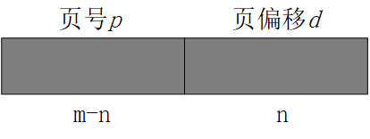
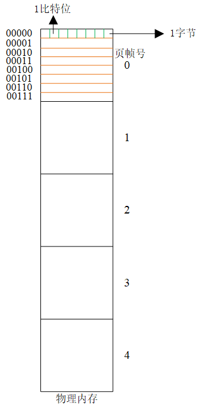
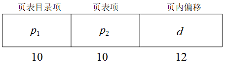
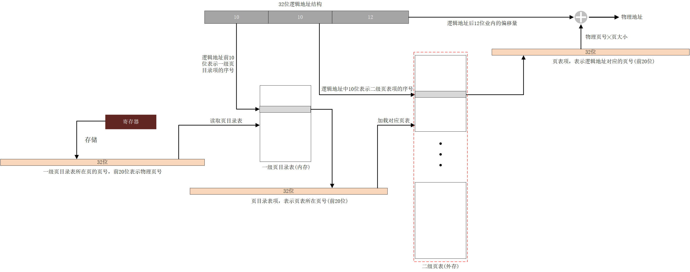

# 第8章 内存管理策略

### 基本概念

内存可以看作是由一个很大的字节数组来组成的，每个字节都有各自的地址（在以字节寻址系统中），字节是操作系统的最小寻址单元。CPU根据程序计数器的值从内存中提取指令，这些指令又可能引对特定内存地址的额外加载与存储（读取操作数或者转储计算结果）。

### 基本硬件

CPU可以直接访问的通用存储只有内存和处理器内置的寄存器，进程运行时的程序和数据都应预先加载到内存中。为了解决CPU处理速度和内存访问速度不匹配的问题，在CPU芯片上增加更快的内存称为**高速缓存**。

**基地址寄存器：**存储进程最小的合法的物理内存地址，防止影响其它的进程。

**界限地址寄存器：**指定了当前进程可访问空间的大小。

### 地址绑定

CPU根据地址获取指令执行，这里的地址是用户程序中的地址通常称为逻辑地址，**逻辑地址**描述的一般是同一个进程中不同指令之间的相对地址，例如地址0、1、2、3...，因此逻辑地址也称为**相对地址**。而进程实际上是存储在内存中的，其存储位置可以是任何可用的内存空间地址。那么在执行时就必须要知道指令所在的实际内存地址，称为**物理地址**（绝对地址）。因此，CPU执行根据地址获取指令时需要将逻辑地址转换为物理地址后才能获取到相应的指令。地址绑定就是从一个地址空间到另一个地址空间的映射，这里是**逻辑地址空间**到**物理地址空间**的映射。

#### 地址绑定的时机

* **编译时：**在编译阶段就固定进程在内存中的驻留地址，逻辑地址就是物理地址，该方式不够灵活；
* **加载时：**程序的地址都是相对地址，直到加载程序时才根据重定位寄存器的值绑定逻辑地址到物理地址上；
* **执行时：**程序可以在内存中移动，直到程序真正执行时才进行地址绑定。

## 连续内存分配

采用连续内存分配时，每个进程都位于一个连续的内存区域。

### 固定分区分配

固定分区分配策略将内存分为多个固定大小的分区，每个分区中只存放一个进程，这些分区可以是大小相等的也可以是不等的。

**缺点：**1. 分区内会产生内部碎片；2. 可能无法运行较大的进程，进程所需空间大于最大分区的大小。

**内部碎片**是在分配给某一进程的内存空间中，该进程没有使用而且其它进程也无法使用的内存区域。

### 可变分区分配

系统维护一个系统空闲分区表，记录多个可用空闲分区的起始地址和大小，在为进程分配内存时按需分配，空闲分区剩余的部分会变成新的空闲分区。当进程释放内存时，如果有相邻的空闲分区就会进行合并操作。

**缺点：**长时间后会产生小的无法使用的空闲分区，称为外部碎片。

**外部碎片**是在多个已分配的进程空间之间存在的较小的无法被利用的内存空间，外部碎片可以通过**紧缩**技术来解决，紧缩技术通过利用重定位寄存器在内存中移动进程，使多个进程的地址空间变成连续的。但是在内存中移动进程的代价较大。

#### **可变分区分配中分区选择策略：**

* 首次适应：基于地址排序的策略选择空闲分区，每次从低地址开始搜索第一个大小合适的空闲分区，也可以从上次选择的分区的地址开始搜索；
* 最优适应：基于空闲分区大小的递增顺序选择合适的空闲分区分配，这种策略会使得分配后可能产生较小的无法再次利用的空闲分区（**外部碎片**）；
* 最差适应：基于空闲分区大小递减的顺序选择合适的空闲分区分配，这种策略分配分区后剩余部分仍然较大不易产生外部碎片，但是长时间运行后系统中可能没有大分区可用。

**总结：**首次适应和最优适应在执行时间和利用空间方面都好于最差适应，首次适应和最优适应在利用空间方面难分伯仲，但首次适应要更快些。

## 非连续内存分配

非连续内存分配策略在为进程分配内存时不要求进程处于连续的空间内，采用这种策略分配内存，系统将更容易满足进程的需求，内存的利用率也更高。

### 分段策略

整个进程被划分为多个段，每个段需要占用连续的内存空间，各个段之间可以不连续。那么为了检索到进程中的每指令或数据，就需要知道它们所在的段以及在段中的地址，这里所在段通过段号检索，在段中的地址可以根据其在段中的相对地址（**相对于段基地址的偏移量**）确定。因此在基于分段的内存管理策略中，逻辑地址可以由<段号，偏移>组成。

#### 将逻辑地址转换物理地址：

实现由<段号,偏移>到物理地址的转换需要段表的支持，段表中保存了每个段对应的**段基地址**（对应段在物理内存中的开始物理地址）以及**段界限**（段的最大长度），那么在逻辑地址转为物理地址时，通过段表找到段的段基地址加上偏移就是实际的物理地址。

### 分页策略

分段是从用户的角度出发对进程进行划分，分页则从操作系统的角度出发将物理内存和进程都划分为大小相同的页帧和页。在将进程加载进内存时，每个进程页放入到物理内存的页帧中，由于大小相同每个进程平均只会产生二分之一页帧大小的内存碎片（**当进程最后一部分无法占满一页大小时产生碎片**）。进程所在的页帧可以是连续的也可以是离散的，那么进程的逻辑仍需要通过所在页号和页内偏移来表示<页号,偏移>。

#### 分页存储管理的逻辑地址结构如下图所示：

这是一个m位的逻辑地址空间，那么它所能表示的最大逻辑地址位2m字节（在以字节为寻址单元的系统中），实际上就是m位的二进制数据能够表示出多少个字节的问题。这里后n位用来表示页内偏移的大小*d*，那么页内偏移的最大值也就是页的大小2n字节，前m-n位则表示页号*p*。

#### 分页存储管理内存划分

#### 将逻辑地址转换物理地址：

由<页号,偏移>到物理地址的转换需要页表的支持，页表记录了每个页号对应的物理页帧号。对于给定的页号为*p*页内偏移为*d*的逻辑地址，首先根据页表找到对应的页帧号*f*，然后物理地址的计算公式可表示为：2n * *f* + *d*.

### 转换表缓冲区（TLB）

在基于分页存储的内存管理系统中，CPU获取每条指令需要访问两次内存，第一次访问页表找到指令的物理地址，第二次才是真正去内存中读取指令。这使得内存访问的开销变大，因此通过引入TLB缓存页表条目在一定的概率上减少内存的访问次数。TLB的存储能力有限，需要根据一定的策略不断替换TLB中缓存的页表条目。这样，CPU每次获取指令时先去TLB中查找页表项，如果能够找到就直接获取到指令的物理地址，否则需要去页表中查询。

## 页表结构

### 分层页表

页表需要常驻内存，而对于较大的进程其页表也较大，从而导致进程页表本身占用了过多的内存。为了解决这一问题，引入了分层页表的概念。例如在两层页表中，将进程的整个页表划分为多个页表称为二级页表，并且为这些页表构建相应的索引表称为一级页表。

### 逻辑地址结构

32位的二级页表的逻辑地址结构中，前10位*p*1地址用于表示相应的二级页表，*p*2中的地址表示相应页表中的页表项中保存的物理页的序号。二级页表能够检索的最大地址同样为2*p*1 * 2*p*2 * 2*d* = 232。

### 二级页表地址转换

#### 地址转换示意图：

初始时只有一级页目录表在内存中，在进行地址转换时再将需要的二级页表调入内存，处理器根据寄存器中的值找到一级页目录表所在的内存页。

逻辑地址中的页内偏移量位12位，整个逻辑地址空间被分割成220个页，为了表示出所有的页的序号就需要20个比特位，因此至少需要3个字节，计算机系统中通常采用2的幂，所以使用4个字节保存页号。在一级页目录表和页表中的每个表项都是32位，一页的可存储的表项数量为212/4=1024个。表项中的数据前20位用来表示页的序号，其它位可以用来记录页的状态信息。

一级页表的地址转换过程可直接根据前20位找到对应的页表项获取物理页号。

# 第9章 虚拟内存管理

## 采用虚拟内存管理的目的

虚拟内存管理技术能够在不装入整个进程的前提下运行进程，那么内存中能够存放更多的进程从而提升并发性能。在实际程序的研究中发现，在许多情况下都是不需要将整个程序置于内存中的：

* 程序通常具有处理异常错误条件的代码，由于错误很少实际发生，所以这些代码几乎从不执行；
* 数组、链表和表等所分配的内存量通常多余实际需要值；
* 程序的某些选项和功能可能很少使用；

另外，即使在需要整个程序的情况下，也可能并不同时需要整个程序，分段能够执行只有部分处于内存的程序可以带来一定的优势：

* 程序不再受物理内存的可用量所限制，可采用交替使用内存的方式实现；
* 由于每个用户程序可占用较少的物理内存，因此整个内存中可以同时运行更多的程序，进而增加CPU利用率和吞吐量，但没有增加响应时间和周转时间；
* 由于加载或交换每个用户程序到内存所需要的I/O回更少，用户程序回运行得更快；

### 什么虚拟存

虚拟内存将用户逻辑内存与物理内存分开，在前面提到的分页存储管理等管理方式中，用户程序的逻辑地址空间与实际的物理地址空间是相同的。而在这里通过虚拟技术，给用户提供了远大于实际物理地址空间的逻辑地址空间称为虚拟内存。

## 请求调页

进程调入内存的策略包含前面的一次性调入整个进程以及采用虚拟技术的每次仅调入进程的一部分进入内存，在需要时才把相应的页调入内存的技术称为请求调页，这种策略尝尝用于虚拟内存系统。

在请求调页系统中，每个进程分配到一定数量的页帧，在运行进程时内存中只有进程的部分页。那么在进程需要执行一个不在内存中的页时就会发生缺页中断，此时系统会利用缺页处理程序将所需的页按照一定的策略调入内存后继续运行进程。

### 缺页处理的过程

1. 检查进程的内部表，以确定该引用（是否为合法地址）是有效的还是无效的内存访问；
2. 如果引用无效，那么终止进程，如果引用有效但是尚未调入页面，那么就启动缺页处理程序进行调页；
3. 找到一个空闲的页帧；
4. 调度一个磁盘操作，以将所需要页面读到刚分配的页帧；
5. 页加载完成后，修改进程的内部表和页表，以指示该页现在处于内存中；
6. 重启被陷阱中断的指令；

## 页面置换算法

系统为每个进程分配一定数量的页帧，初始时进程都不在内存中，当开始执行进程时，系统会加载相应的页到内存的空闲页帧中。当进程所分配的空闲页帧使用完后，再调入新的页就需要考虑将内存中哪个页帧中的页覆盖掉用于存放最新需要访问的页，此时就涉及到如何选择的问题，也就是页面置换策略的问题。为了评价页面置换算法的性能，通常根据页面请求序列所产生的中断频率来评价，缺页中断频率越低，说明算法越好。

#### FIFO页面置换算法

该算法采用先进先出的页面置换策略，采用该算法时，系统会根据需要覆盖最先进入内存的页。FIFO算法易于理解和实现，但是其性能往往较差，另外采用该算法时随着分配给进程的物理页帧数量的增加反而有可能导致缺页率上升，通常来说进程分配到的内存越多，缺页率应该越小，这种异常的结果被称为**Belady异常**。

#### 最优页面置换算法（optimal page-replacement algorithm, OPT）

该算法在选择置换页面的时候是选择在未来请求序列中最不可能用到的页面，也正因为如此，最优页面置换算法是难以是实现的，因为无法预知将来的事情。但是该算法可以用作参考，以判断其它算法的性能。

#### LRU页面置换算法（最近最少使用算法）

该算法是考虑在已经访问过的请求序列中，选择相对于当前请求最久没有使用的页面进行置换。

#### 时钟置换算法

该算法将进程内存中的页组织成循环队列，每次需要置换页面时从指针当前位置开始搜索使用位（页面是否被用过，使用过则使用位标志为1，否则为0）为0的页进行置换，如果当前所指页面使用位为1，则指针后移并将使用位置为0，直到找到第一个使用位为0的为止。

#### 增强时钟置换算法

在决定是否置换某也时除了考虑该页最近是否被使用过外，还需要考虑该页的内容是否已经被修改，因为被修改的页面在调出时需要写回外存比较耗时，因此一般不置换被修改的页面。增强时钟置换算法就是在考虑使用位的基础上考虑了修改位的信息。页面的状态信息包含以下四种：

* （0，0）最近没有使用也没有修改的页面，最佳的置换页面；
* （0，1）最近没有使用，但是被修改了的页面；
* （1，0）最近使用过但是没有被修改的页面；
* （1，1）最近使用过而且被修改过的页面；

在进行页面置换时，首先搜索有没有（0，0）状态的页面，并且在搜索过程中会将使用位置为0，在搜索一遍之后没有找到（0，0）会再进行一轮搜索（上一轮已经将所有的使用位置0，再次搜索很有可能找到（0，0））；如果还是找不到则会尝试置换（0，1）状态的页面。