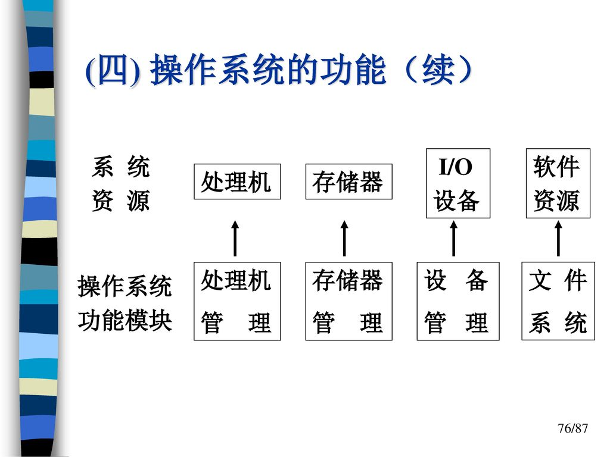
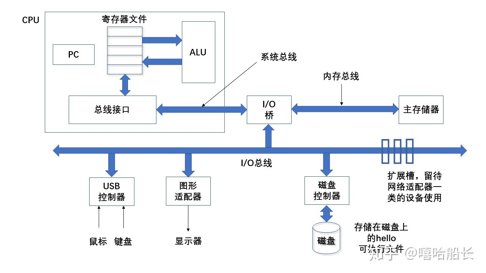
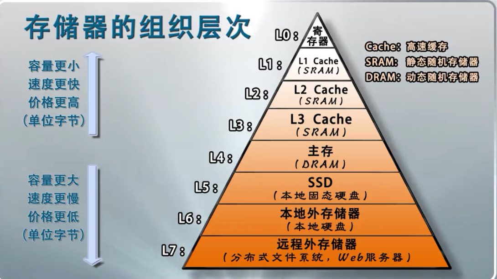
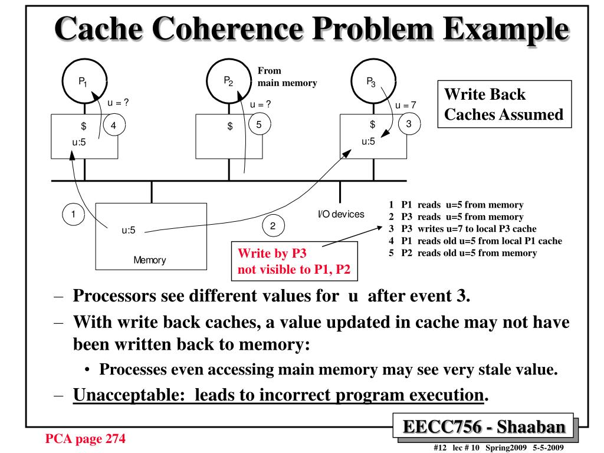
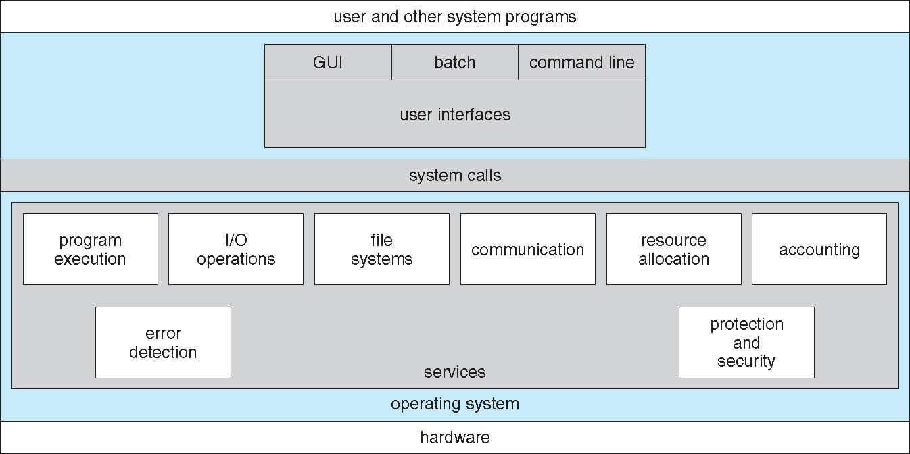
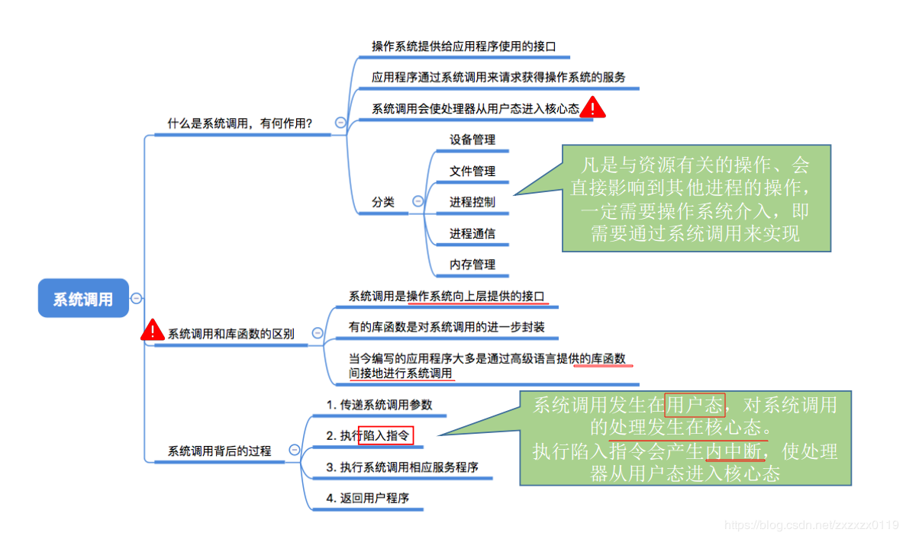
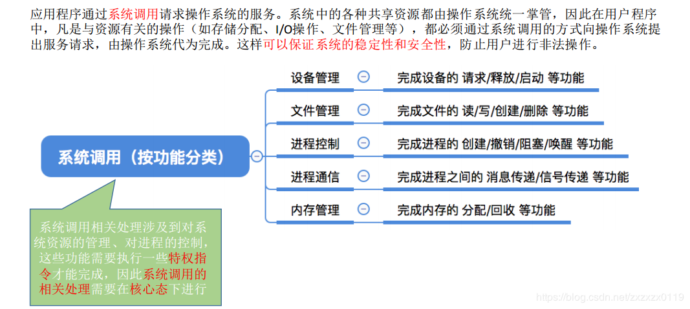
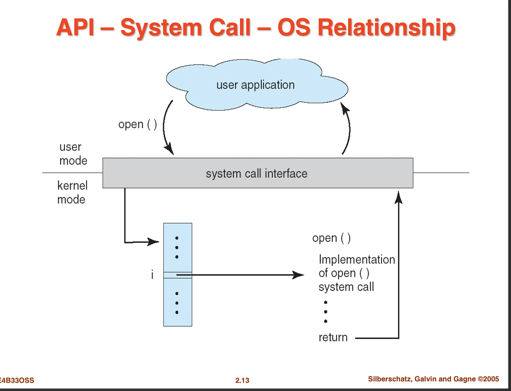

[TOC]

### 0 目标

​		本章内容将《操作系统概念》一书中的第一章和第二章总结为一个概论章节。目标如下

- 描述操作系统的功能。

- 描述计算机系统的基本组成。

- 概述操作系统的主要组件。

- 描述操作系统为用户、进程和其他系统提供的服务。

- 讨论构建操作系统的各种方式。

- 解释如何安装与定制操作系统以及如何启动操作系统。

  后面的内容将会围绕着这些核心概念来讲解。

### 1. 概论 

​		**操作系统（operating system）**是管理计算机硬件的程序。操作系统还为应用程序提供基础，并且充当计算机用户和计算机硬件的中介。

#### 1.1 操作系统的功能

​		**操作系统** 是控制和管理计算机系统的**硬件和软件资源**，合理的组织计算机**工作流程**以及方便用户**使用**,是一种**系统软件**。设置操作系统的目的就是提高计算机系统的**效率**，增强系统的**处理能力**，充分发挥系统的**利用率**，方便用户**使用**。

#### 1.2 计算机系统的组成

​		由一个或多个CPU和若干设备控制器通过共同的总线相连而成，该总线提供了对共享内存的访问。每个设备控制器负责一种特定类型的设备。每个设备控制器负责一种特定类型的设备（如：磁盘驱动器、音频设备、视频显示其）。CPU与设备控制器可以并发工作，并竞争内存周期。为了确保对共享内存的有序访问，需要内存控制器来协调对内存的访问。

##### 1.2.1 总线

​		总线（Bus）是计算机各种功能部件之间传送信息的公共通信干线，它是 CPU 、内存、输入输出设备传递信息的公用通道。计算机的各个部件通过总线相连接，外围设备通过相应的接口电路再与总线相连接，从而形成了计算机硬件系统按照所传输的信息种类，总线包括一组控制线、一组数据线和一组地址线。总线的分类包括以下几种

- 内部总线：用于 CPU 芯片内部连接各元件；
- 系统总线：用于连接 CPU 、存储器和各种 I/O 模块等主要部件
- 通信总线：用于计算机系统之间通信。

##### 1.2.2 I/O设备

​		示例包含四个I/O设备：鼠标、键盘、显示器、磁盘。每个I/O设备都通过一个控制器或适配器与I/O总线相连。（控制器：是I/O设备本身或者系统的主印制电路板上的芯片组；适配器：一块插在主板上的卡）。

##### 1.2.3 存储结构

​		临时存储设备，存放程序和程序处理的数据。**物理上**，主存是一群动态随机存取存储器（DRAM）芯片。**逻辑上**，存储器是一个线性的字节数组，每个字节都有其唯一的地址。

​		L0 ～ L4 ：挥发性存储器，断电数据消失。

##### 1.2.4 处理器（CPU）

​		解释存储在主存中指令的引擎。核心是一个大小为一个字的寄存器（存储设备），称为程序计数器（PC）。任何时刻，PC都指向主存中的某条机器语言指令。处理器一直在不断地执行程序计数器指向的指令，再更新程序技术器，使其指向下一条指令。处理器看上去是按照一个非常简单的指令执行模型来操作的，由指令集架构决定。

CPU在指令的要求下可能会执行：

- 加载：从主存复制一个字节或一个字到寄存器，以覆盖寄存器原来的内容。
- 存储：从寄存器复制一个字或者字节到主存的某个位置，以覆盖这个位置上原来的内容。
- 操作：把两个寄存器的内容复制到ALU， ALU对这两个字做算术运算，并将结果存放到一个寄存器中，以覆盖该寄存器中原来的内容。
- 跳转：从指令本身中抽取一个字，并将这个字复制到程序计数器（PC）中，以覆盖PC中原来的值。

#### 1.3 计算机系统的体系结构

##### 1.3.1 单处理器系统

​		直到最近，大多数系统仍采用单处理器。单处理器系统只有一个主 CPU，以便执行一个通用指令集，该指令集包括执行用户进程的指令。几乎所有单处理器系统都带有其他专用处理器。它们或为特定设备的处理器，如磁盘、键盘、图形控制器；或为更通用的处理器，如在系统组件之间快速移动数据的 I/O 处理器。

​		所有这些专用处理器执行有限指令集，而并不执行用户进程。在有的环境下，它们由操作系统来管理，此时操作系统将要做的任务信息发给它们，并监控它们的状态。例如，磁盘控制器的微处理器接收来自主 CPU 的一系列请求，并执行自己的磁盘队列和调度算法。这种安排使得主 CPU 不必再执行磁盘调度。PC 的键盘有一个微处理器来将击键转换为代码，并发送给 CPU。

​		在其他的环境下，专用处理器作为低层组件集成到硬件。操作系统不能与这些处理器通信，但是它们可以自主完成任务。专用处理器的使用十分常见，但是这并不能将一个单处理器系统变成多处理器系统。如果系统只有一个通用 CPU，那么就为单处理器系统。

##### 1.3.2 多处理器系统

​		近年来，**多处理器系统（multiprocessing system**，也称为**并行系统（parallel system)**或**多核系统（multicore system））**开始主导计算领域。这类系统有两个或多个紧密通信的 CPU，它们共享计算机总线，有时还共享时钟、内存和外设等。多处理器系统起初主要应用于服务器，后来也应用于桌面和笔记本系统。近来，多处理器也出现在移动设备上，如智能手机和平板电脑。

​		多处理器系统有三个主要优点：
​		**增加吞吐量**：通过增加处理器数量，以期能在更短时间内完成更多工作。采用 N 个处理器的加速比不是 N，而是小于 N。当多个 CPU 协同完成同一任务时，为了让各部分能够正确执行，会有一定的额外开销。这些开销，加上竞争共享资源，会降低因增加了 CPU 的期望增益。这类似于 N 位程序员一起紧密工作，而不能完成 N 倍于单个程序员的工作量。
​		**规模经济**：多处理器系统的价格要低于相同功能的多个单处理器系统的价格，因为前者可以共享外设、大容量存储和电源供给。如果多个程序需要操作同一数据集，那么将这些数据放在同一磁盘并让多处理器共享，将比采用多个具有本地磁盘的计算机和多个数据副本更为节省。
​		**增加可靠性**：如果将功能分布在多个处理器上，那么单个处理器的失灵不会使得整个系统停止，而只会使它变慢。如果 10 个处理器中的 1 个出了故障，那么剩下的 9 个会分担起故障处理器的那部分工作。因此，整个系统只是比原来慢了 10%，而不是完全失败。

#### 1.4 中断

​		中断是一种在系统内硬件产生的流量变化。中断操作装置是用来处理中断请求；然后返回控制中断的上下文和指令。陷阱是软件产生的中断。中断可以被用来标志I/O的完成，从而排除设备投票站的需要。陷阱可以被用来调用操作系统的程序或者捕捉到算术错误。

#### 1.5 高速缓存一致性

​		单处理器系统、多处理器系统和分布式系统中如何保存高速缓存一致性？单处理器系统中，位于高速缓存的一个值更新时，应该马上反映到所有其他该值所在的高速缓存。多处理器系统中，不同的进程或许在他的本地存储上存储相同的内存位置，当更新发生时，其他存储的位置需要使其无效或更新。在分布式系统中，同一文件的多个副本会出现在不同场所的不同计算机上，由于各个副本可能会被并发访问和更新，所以应该确保当一处的副本被更新时，所有其他副本应尽快得以更新。

### 2 操作系统结构

​		操作系统提供环境以便执行程序。操作系统的内部结构差别很大，有许多不同的组织方式。

#### 2.1 操作系统服务

​		操作系统位于底层硬件与用户之间，是两者沟通的桥梁。用户可以通过操作系统的用户界面，输入命令。操作系统则对命令进行解释，驱动硬件设备，实现用户要求。以现代标准而言，一个标准PC的操作系统应该提供以下的功能：

- 进程管理（Processing management）
- 内存管理（Memory management）
- 文件系统（File system）
- 网络通信（Networking）
- 安全机制（Security）
- 用户界面（User interface）
- 驱动程序（Device drivers）

#### 2.2 系统调用

​		操作系统的主要功能是为管理硬件资源和为应用程序开发人员提供良好的环境来使应用程序具有更好的兼容性，为了达到这个目的，内核提供一系列具备预定功能的多内核函数，通过一组称为**系统调用（system call)**的接口呈现给用户。系统调用把应用程序的请求传给内核，调用相应的内核函数完成所需的处理，将处理结果返回给应用程序。 
​		现代操作系统通常都具有多任务处理的功能，通常靠进程来实现。由于操作系统快速的在每个进程间切换执行，所以一切看起来就会像是同时的。同时这也带来了很多安全问题，例如，一个进程可以轻易的修改进程的内存空间中的数据来使另一个进程异常或达到一些目的，因此操作系统必须保证每一个进程都能安全的执行。这一问题的解决方法是在处理器中加入基址寄存器和界限寄存器。这两个寄存器中的内容用硬件限制了对储存器的存取指令所访问的储存器的地址。这样就可以在系统切换进程时写入这两个寄存器的内容到该进程被分配的地址范围，从而避免恶意软件。
​		为了防止用户程序修改基址寄存器和界限寄存器中的内容来达到访问其他内存空间的目的，这两个寄存器必须通过一些特殊的指令来访问。通常，处理器设有两种模式：**“用户模式”**与**“内核模式”**，通过一个标签位来鉴别当前正处于什么模式。一些诸如修改基址寄存器内容的指令只有在内核模式中可以执行，而处于用户模式的时候硬件会直接跳过这个指令并继续执行下一个。

