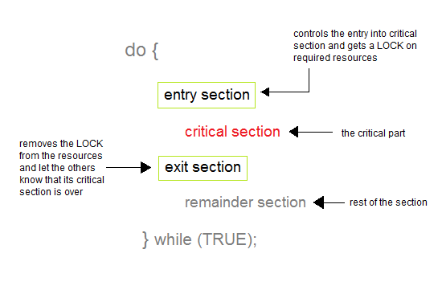
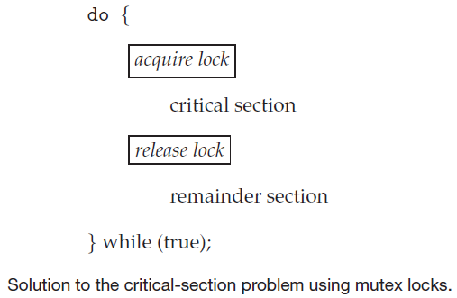

[TOC]


### 0 目标

​		本章内容来自于《操作系统概念》 第6章和《Linux内核设计与实现》 第9章 + 第10章这三个章节，目标是通过这三章内容的学习能够里里外外理解临界区和协作进程。

1. **竞争条件**的概念及其产生的原因。
2. **临界区**和**临界区问题**的概念。
3. 临界区问题的软件解决方案。
4. **互斥锁**。
5. **信号量**。
6. **死锁**和**饥饿**。
7. 分析进程同步的多个经典问题。
8. 探讨解决进程同步问题的多个工具。

### 1 背景

​		操作系统中为了支持并发执行会使用进程调度程序快速切换程序，这意味着一个进程被调度前可能只完成了部分执行。事实上，一个进程在其指令流上的任何一点都可能会被中断，并且处理核可能会用于执行其他进程的指令。此外，并发执行代表不同进程的两个指令流同时执行在不同处理核上。<u>本章解释，并发或并行执行如何影响多个进程共享数据的完整性。</u>

​		本节讨论使用**生产者-消费者**问题来讨论异步执行的进程/线程如何共享数据。分别给出生产者进程代码和消费者进程代码，然后分析共享数据时遇到的问题。

```c
/*
生产者进程代码

BUFFER_SIZE - 1: 是有界缓冲区的大小
count: 缓冲区元素统计量
in: 元素位置
*/
while (true) {
	// 有界缓冲区为满，produce an item in next_produced
	while (count == BUFFER_SIZE)
  	;
  
  buffer[in] = next_produced;
  in = (in + 1) % BUFFER_SIZE;
  count++;
}
```

```c
/*
消费者进程代码

BUFFER_SIZE - 1: 是有界缓冲区的大小
count: 缓冲区元素统计量
out: 元素位置
*/
while (true) {
	// 有界缓冲区为空
	while (count == 0)
  	;

  next_consumed = buffer[out];
  out = (out + 1) % BUFFER_SIZE;
  count--;
}
```

两个代码块中的生产者进程代码和消费者进程代码完全正确，但是并发执行时它们可能不能正确执行。

为了说明起见，假设变量count的值为5，此时分别执行下面的语句

```c
// 生产者进程
count++
  
// 消费者进程
count--
```

令人惊讶的是，变量count的值此时可能为 4 、 5 、 6。为什么会发生这种情况呢？下面的代码片中会详细解释。

```c
// count++ 翻译成低级语句
1 register1 = count
2 register1 = register1 + 1
3 count = register1

其中register1为本地寄存器。
  
// count-- 翻译成低级语句
1 register2 = count
2 register2 = register2 - 1
3 count = register2

其中register2为本地寄存器。
  
// 并发执行 count++ 和 count--相当于按照任意顺序来交替执行上面低级语句，低级语句间的顺序不会发生变化
// 可能的情况有多种，此处给出一种
T0 生产者 执行 register1 = count         {register1 = 5}
T1 生产者 执行 register1 = register1 + 1 {register1 = 6}
T2 消费者 执行 register2 = count         {register2 = 5}
T3 消费者 执行 register2 = register2 - 1 {register2 = 4}
T4 生产者 执行 count = register1         {count = 6}
T5 消费者 执行 count = register2         {count = 4}

// ERROR!!!  
```

​		因为允许两个进程并发操作变量_count_,像这样的情况，即多个进程并发访问和操作同一数据并且执行结果与特定的访问顺序有关，称为**竞争条件（race condition）**:exclamation: 。

​		看到这里，我们完成了本章的第一个目标——**竞争条件**的概念及其产生的原因:+1:。为了解决竞争条件的问题，需要确保一次只能有一个进程操作变量*count*，这种保证引出了第二节的内容——**临界区（critical section）**。

### 2 临界区问题

​		**临界区（critical section）**是进程中的一段代码，其特性是当一个进程在临界区中执行时，其他进程不允许在它们的临界区中执行，也就是说，没有两个进程可以在它们的临界区中同时执行。

​		**临界区问题（critical-section problem）**说的是设计一个协议以便协作进程，在进入临界区之前，每个进程应请求许可，实现这一请求代码区段称为**进入区（entry section）**，临界区之后可以有**退出区（exit section）**，其他代码为**剩余区（remainder section）**。



​		临界区问题的解决方案应满足如下三条要求：

- **互斥(mutual exclusion): ** 如果进程 Pi 在其临界区内执行，那么其他进程都不能在其临界区内执行。

- **进步(process):** 如果没有进程在其临界区内执行，并且有进程需要进入临界区，那么只有那些不在剩余区内执行的进程可以参加选择，以便确定谁能下次进入临界区，而且这种选择不能无限推迟。

- **有限等待(bounded waiting):** 从一个进程做出进入临界区的请求直到这个请求允许为止，其他进程允许进入其临界区的次数具有上限。

  ​		有两种常用方法，用于处理操作系统的临界区问题：**抢占式内核（preemptive kernel）**	与 **非抢占式内核（nonpreemptive kernel）**, 抢占式内核允许处于内核模式的进程被抢占，非抢占式内核不允许出于内核模式的进程被抢占。处于内核模式的进程会一直执行，直到退出内核模式、阻塞或资源放弃CPU控制。

  ​		显然，非抢占式内核的数据结构基本不会导致竞争条件，因为在一个时间点只有一个进程处于内核模式。然而，抢占式内核需要认真设计，以确保内核数据结构不会导致竞争条件。对于SMP体系结构，抢占式内核更难设计，因为这些环境下两个处于内核态的进程可以同时运行在不同处理器上。

### 3 Peterson解决方案（临界区问题软件解决方案）

​		**Peterson算法**是一个实现[互斥锁](https://zh.wikipedia.org/wiki/互斥锁)的并发程序设计算法，可以控制两个进程访问一个共享的单用户资源而不发生访问冲突。Gary L. Peterson于1981年提出此算法。Peterson算法是基于双线程互斥访问的LockOne与LockTwo算法而来。LockOne算法使用一个flag布尔数组，LockTwo使用一个turn的整型量，都实现了互斥，但是都存在死锁的可能。Peterson算法把这两种算法结合起来，完美地用软件实现了双线程互斥问题。

​		算法使用两个控制变量 *flag* 与 *turn* . 其中 *flag[n]* 的值为真，表示 ID 号为 n 的进程希望进入该[临界区](https://zh.wikipedia.org/wiki/临界区). 变量 *turn* 保存有权访问共享资源的进程的 ID 号.

```c
//flag[] is boolean array; and turn is an integer
flag[0] = false;
flag[1] = false;
int turn;
```

 

```c
P0: 

flag[0] = true; 
turn = 1;       
while (flag[1] == true && turn == 1) 
{
   // busy wait
}

// 临界区 critical section
... // 如果进程 P0 能够到达这个位置， 那么flag[1] == false 或 turn == 0
... // flag[1] == false 说明进程P1离开了自己的临界区
... // turn == 0 说明进程P1只能在临界区外面等待
// end of critical section

flag[0] = false;   // 进程P0离开临界区
```


```c
P1: 

flag[1] = true;
turn = 0;
while (flag[0] == true && turn == 0)
{
   // busy wait
}

// 临界区 critical section
... // 如果进程P1能够到达这个位置，那么 flag[0] == false 或 turn == 1
... // flag[0] == false 说明进程P0离开了自己的临界区
... // turn == 1 说明进程P0只能在临界区外面等待
// end of critical section

flag[1] = false;  // 进程P1离开临界区 
```

​		该算法满足解决临界区问题的三个必须标准：互斥访问、 进入（即不死锁）和 有限等待。

**互斥访问**

​		*P0* 与 *P1* 显然不会同时在临界区。如果进程 *P0* 在临界区内，那么或者 *flag[1]* 为假(意味着 *P1* 已经离开了它的临界区)，或者 *turn* 为 *0* (意味着 *P1* 只能在临界区外面等待，不能进入临界区).

**空闲让进**

​		***进入/进步(Progress)*** 定义为：如果没有进程处于临界区内且有进程希望进入临界区, 则只有那些不处于***剩余区(remainder section)***的进程可以参与到哪个进程获得进入临界区这个决定中，且这个决定不能无限推迟。剩余区是指进程已经访问了临界区，并已经执行完成退出临界区的代码，即该进程当前的状态与临界区关系不大。

**有限等待**

​		***有限等待(Bounded waiting)***意味着一个进程在提出进入临界区请求后，只需要等待临界区被使用有上限的次数后，该进程就可以进入临界区。即进程不论其优先级多低，不应该**饿死(starvation)**在该临界区入口处。Peterson算法显然让进程等待不超过1次的临界区使用，即可获得权限进入临界区。


### 4  互斥锁

​		临界区问题的基于硬件的解决方案不仅复杂，而且不能为程序员直接使用。因此，操作系统设计人员构建软件工具，以解决临界区问题。最简单的工具就是***互斥锁（mutex lock）***。一个进程在进入临界区时应得到锁，退出临界区时应该释放锁。



```c

// 获得锁
acquire() {
	while (!available)
	  ; // busy wait
	
	available = false;
}

// 释放锁
release() {
	available = true;
}
```

​		对于 *acquire()* 和 *release()* 的调用必须原子的执行。这里所给实现的主要缺点是需要 **忙等待（busy waiting**）,当有一个进程在临界区中，任何其他进程在进入临界区时必须连续循环调用 *acquire()* , 其实这种类型的互斥锁也称为**自旋锁（spinlock）**, 因为进程不停地旋转，以等待锁变的可用。在多道程序系统中，当多个进程共享同一CPU时，这种连续循环等待显然是个问题。**忙等待浪费了本可以用于其他进程的CPU周期。**

​		不过，自旋锁确实有一个优点：当进程在等待时，没有上下文切换。考虑到上下文切换可能需要相当长的时间，因此当使用锁的时间较短时，自旋锁还是有用武之地的。自旋锁通常用于多处理器系统，一个线程可以在一个处理器上“旋转”，而其他线程在其他处理器上执行临界区。

### 5 信号量

​		互斥锁是最简单的同步工具，而**信号量（semaphore）**是一个更强大、更鲁棒的方法。

​		**信号量（semaphore）S** 是一个整型变量，它除了初始化外只能通过两个标准原子操作：*wait()* 和 *signal()* 来访问。操作 *wait()* 最初称为 P， 操作 *signal()* 最初称为V。

```c

wait(S) {
  while (S <= 0) {
    ; // busy wait
  }
  S--;
}

signal(S) {
  S++;
}

```

​		操作 *wait()* 和 操作 *signal()*中，信号量整数值的修改应该不可分割的执行。也就是说，当一个进程修改信号量的值时，没有其他进程能够同时修改同一信号量的值。

#### 5.1 信号量的使用

​		操作系统通常区分计数信号量与二进制信号量。**计数信号量（counting semaphore）** 的值不受限制，而**二进制信号量（binary semaphore）** 的值为 0 或 1。因此，二进制信号量类似于互斥锁。事实上，在没有提供互斥锁的系统上，可以使用二进制信号量来提供互斥。

​		计数信号量可以用于控制访问具有多个实例的某种资源。信号量的初值为可用资源数量。当进程需要使用资源时，需要对该信号量执行*wait()*操作（减少信号量的计数），当进程释放资源时，需要对该信号量执行signal()操作（增加信号量的计数）。当信号量的计数为0时，所有资源都在使用中。之后，需要使用资源的进程都会阻塞，知道计数大于0。

#### 5.2 信号量的实现

​		上面描述的信号量操作 *wait()* 和  *signal()*, 也有同样问题。为了克服忙着等待需要，可以这样修改信号量操作的定义：当一个进程执行操作 *wait()* 并发现信号量值不为正时，它必须等待，然而该进程不是忙等待而是阻塞自己。阻塞操作将一个进程放到与信号量相关的等待队列中，并且将该进程状态切换为等待状态。然后，控制转到CPU调度程序，以便选择执行另一个进程。

 	等待**信号量S**而阻塞的进程，将其他进程执行操作 *signal()* 后，应被重新执行。进程的重新执行是通过操作 *wakeup()* 来进行的，它将进程从等待状态改为就绪状态。然后，进程被添加到就绪队列。（取决于CPU调度算法，CPU可能会也可能不会从正在运行的进程切换到新的就绪进程。）

```c
typedef struct {
	int value;
	struct process* list;
} semaphore;
```

​	每个信号量都有一个整数 *value* 和 一个进程链表 *list* 。当一个进程必须等待信号量时，就被添加到进程链表，操作 *signal()* 从等待链表上取走一个进程，并加以唤醒。

```c
wait(semaphore* S) {
	S->value--;
	if(S->value < 0) { // 信号量S的值 不为正，阻塞自己，并将进程状态切换为等待状态
		add this block to S->list;
		block(); // 挂起线程
	}
}

signal(semaphore *S) {
	S->value++;
	if(S->value <= 0) { // 
		remove a process P from S->list; // 从等待链表上取走一个进程P
		wakeup(P); // 唤醒进程P
	}
}
```

​		注意，这样的信号量的值可能为负数，而在具有忙等待的信号量经典定义下，信号量的值不能为负。如果信号量为负，那么它的绝对值就是等待它的进程数。

#### 5.3 死锁 & 饥饿

​		具有等待队列的信号量实现可能会导致这样的情况：两个或多个进程无限等待一个事件。而该事件只能由这些等待进程之一来产生。这里所说的时间就是 *signal()* 。当出现这样的状态时，这些进程就称为**死锁（deadlock）。**


### 6 经典同步问题

#### 6.1 有界缓冲区问题

#### 6.2 读者-作者问题

#### 6.3 哲学家就餐问题

